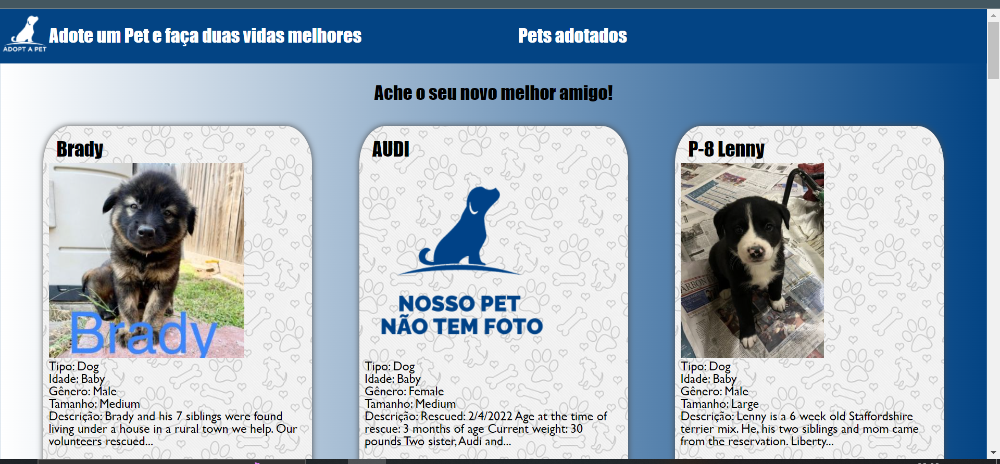

# Adopt a Pet

Project made using django. The main purpose of the project was to create a website for adopting pets. For data extraction, a public and free API provided by the company Purina was used. ([link to API documentation](https://www.petfinder.com/developers/v2/docs/#introduction))

